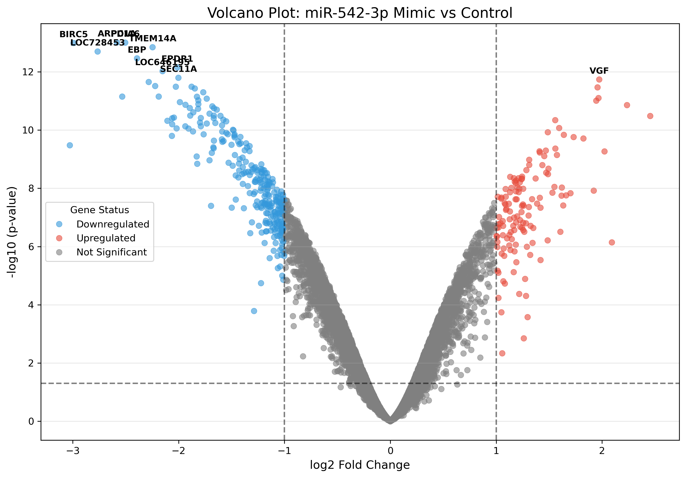
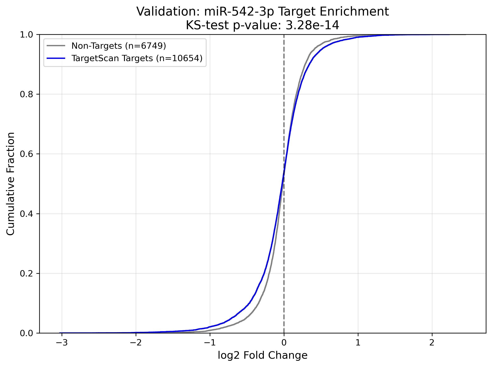

# Differential Gene Expression Analysis of GSE47363 Dataset Using limma

**Investigating the transcriptomic impact of miR-542-3p mimics in human cell lines.**

## Project Overview
This repository contains a reproducible pipeline for the differential expression analysis of the GSE47363 dataset. The study compares a miR-542-3p treatment group against a negative control group to identify gene expression changes induced by the miRNA mimic.

The analysis is performed using the limma framework (implemented via InMoose) to handle Illumina microarray intensities.

## Key Features
Data Processing: Loading and processing of non-normalized Illumina intensity files.

Gene Deduplication: Utilization of the MaxMean method to handle multiple probes mapping to the same gene symbol.

Statistical Modeling: Linear modeling and empirical Bayes moderation via limma.

Multiple Testing Correction: Implementation of the Benjamini-Hochberg (BH) procedure to control the False Discovery Rate (FDR).

## Repository Structure
```text
├── .devcontainer/      # Docker & DevContainer configuration
├── data/               # (User-created) Input directory for GEO and validation files
├── notebooks/          # Jupyter notebook for DE analysis and interpretation
├── results/            # Output: iPathway Guide input file, CDF and Volcano plots
└── README.md
```
## Getting Started

### Prerequisites
* Python 3.10+
* InMoose (for limma implementation)
* pandas, numpy, and matplotlib/seaborn for visualization

### Data Acquisition
This analysis requires three specific files located in the data/ directory.

**1. Expression Data (GSE47363)**

    Source: NCBI GEO GSE47363

    File: GSE47363_non-normalized.txt.gz

    Instructions: Download and extract so that data/GSE47363_non-normalized.txt is available.

**2. Platform Annotations (GPL10558)**
    
    Source: GPL10558 - Illumina HumanHT-12 V4.0

    File: GPL10558_HumanHT-12_V4_0_R1_15002873_B.txt.gz

    Instructions: Rename to GPL10558_annot.txt. This file is used to map Illumina Probe IDs to Gene Symbols. Ensure it is placed in the data/ folder.

**3. TargetScan Validation (Private)**
    
    Source: Provided for validation (not public).

    File: targetscan_validation_results.csv

    Instructions: This file contains the predicted targets for miR-542-3p. It must be manually placed in the data/ folder for the validation step of the pipeline to run.

**4. TargetScan Master Metadata (For Global Ranking)**

    Source: TargetScan Download Page

    Files: * miR_Family_Info.txt

    Predicted_Targets_Info.default_predictions.txt

    Instructions: Download the "Default Predictions" and "miR Family Info" zip files from TargetScan. Unzip both into the data/ folder. These files allow the pipeline to rank miR-542-3p against all other known miRNA families to ensure the result is not a false positive.

### Installation
```bash
git clone https://github.com/adevlen/GSE47363_analysis.git
cd /GSE47363_analysis
cd /.devcontainer
```
### Development Environment
This project is configured for easy reproducibility using Docker. To use the automated VSCode setup:

**1. Install the Extension:**

    Open VS Code.

    Go to the Extensions view (Ctrl+Shift+X).

    Search for and install Dev Containers by Microsoft.

**2. Open the Project:**

    Open this project folder in VS Code.

**3. Reopen in Container:**

    A notification should appear in the bottom right: "Folder contains a Dev Container configuration file. Reopen to folder to develop in a container."

    Click Reopen in Container.

    Alternatively: Click the green "Remote" icon in the bottom-left corner and select "Reopen in Container".

**4. Select Kernel:**

    Once the container finishes building, open notebooks/analysis.ipynb.

    In the top-right corner, ensure "anna_analysis" is selected as the kernel.

## Usage
To run the analysis from scratch, select "Run All" at the top of the analysis.ipynb notebook.

## Results
The analysis identifies key downstream targets of miR-542-3p. Summary plots (Volcano and CDF plots) can be found in the results/ directory.

## Biological Context
Because miRNAs typically function as translational repressors or by inducing mRNA degradation, a successful mimic treatment should show a characteristic 'downregulated tilt' in the transcriptome. 



This can be readily observed in the volcano plot above, where there is a much greater number of blue (downregulated) genes compared to red (upregulated genes) for miR-542-3p compared to the control. The genes in the top left corner of the plot are the most significantly downregulated genes, the top 5 of which are listed in the table below.

| Symbol | log2FC | Adj. P-Value | Biological Function |
| :---: | :---: | :---: | :---: |
| **BIRC5** | \-2.99 | 6.21e-10 | Also known as Survivin; inhibitor of apoptosis and regulator of cell division. |
| **ARPC1A** | \-2.58 | 6.21e-10 | Component of the Arp2/3 complex; regulates actin polymerization and motility. |
| **PDIA6** | \-2.50 | 6.21e-10 | Protein disulfide isomerase; involved in ER protein folding and stress response. |
| **TMEM14A** | \-2.25 | 6.50e-10 | Transmembrane protein; involved in stabilizing mitochondrial membrane potential. |
| **LOC728453** | \-2.76 | 7.30e-10 | Uncharacterized transcript; highly sensitive to miR-542-3p levels. |

Two of the top five downregulated genes, BIRC5 and TMEM14A, are strongly linked to cell survival and apoptosis, meaning that miR-542-3p is likely shutting down survival pathways.

## Global Target Validation
While the top 5 hits highlight individual biological impacts, a global validation using **TargetScan** predicted targets was also performed to confirm the efficacy of the miR-542-3p mimic. 

A Cumulative Distribution Function (CDF) plot was generated to compare the $log_2$ fold changes of predicted miR-542-3p targets against non-targets. 



The predicted targets (blue line) show a significant "left-shift" compared to non-targets (gray dashed line). A Kolmogorov-Smirnov (KS) test confirmed that this shift is statistically significant ($p < 0.05$), providing evidence that the mimic is effectively suppressing its intended biological targets across the entire transcriptome. 

To confirm that the observed expression changes were specifically driven by miR-542-3p, an unbiased enrichment scan of all miRNA families in the TargetScan database was performed using Master TargetScan files. The Kolmogorov-Smirnov (KS) p-value for every predicted miRNA target set, with miR-542-3p appearing at the top:

| Rank | miRNA Family | p-value | n\_targets |
| :---: | :---: | :---: | :---: |
| 1 | miR-542-3p | 6.36E-21 | 331 |
| 2 | miR-542 | 8.75E-18 | 272 |
| 3 | miR-15/16/195/497 | 1.88E-07 | 1275 |
| 4 | miR-34/449 | 5.28E-07 | 749 |
| 5 | miR-34-5p/449-5p | 1.19E-06 | 736 |

This result confirms that the gene expression changes are directly attributable to the experimental treatment.